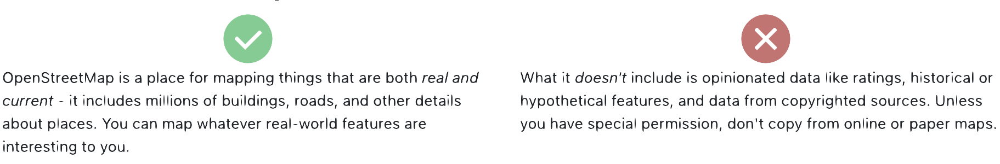
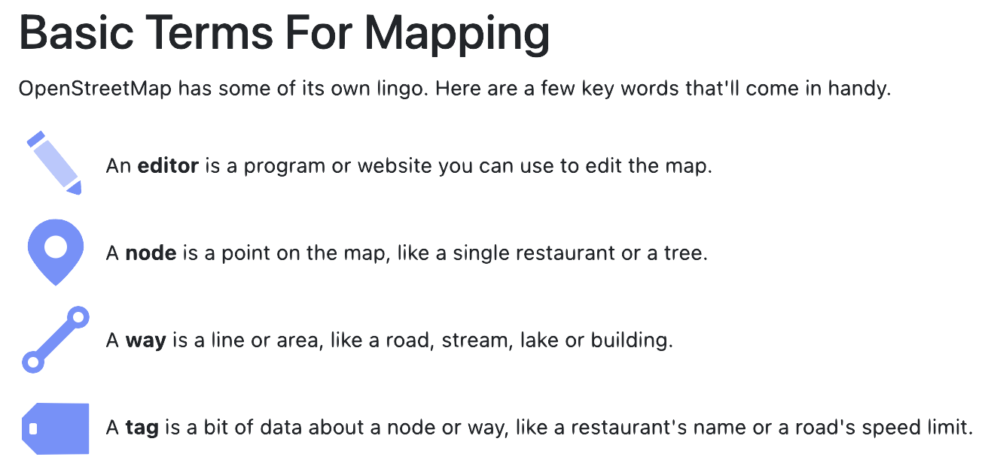
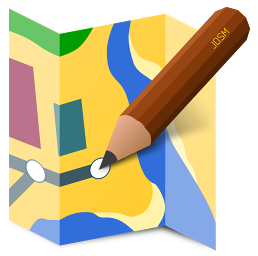
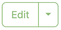
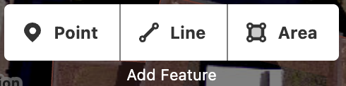
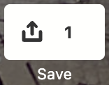

# Mapathon

**Mapping Philly in OpenStreetMap**

  
  

April 2025
<!-- .slide: data-background="./img/img1.png" data-background-size="100%" data-background-opacity="0.3"-->

**Agenda**

<table>
  <tr>
    <th align="center">Time</th>
    <th align="center">Activity</th>
  </tr>
  <tr>
    <td align="center">1:00pm</td>
    <td align="left">What is OpenStreetMap?</td>
  </tr>
  <tr>
    <td align="center">1:15pm</td>
    <td align="left">OSM communities and groups</td>
  </tr>
  <tr>
    <td align="center">1:25pm</td>
    <td align="left">How to contribute?</td>
  </tr>
  <tr>
    <td align="center">1:35pm</td>
    <td align="left">Adding elements to the map</td>
  </tr>
  <tr>
    <td align="center">1:45pm</td>
    <td align="left">Editing tags to add details</td>
  </tr>
  <tr>
    <td align="center">2:00pm</td>
    <td align="left">Break</td>
  </tr>
  <tr>
    <td align="center">2:10pm</td>
    <td align="left">Open mapping time</td>
  </tr>
  <tr>
    <td align="center">2:30pm</td>
    <td align="left">Questions & Answers</td>
  </tr>
  <tr>
    <td align="center">2:50pm</td>
    <td align="left">Wrap up</td>
  </tr>
</table>

## What is OpenStreetMap?

<!-- .slide: data-background="./img/img1.png" data-background-size="100%" data-background-opacity="0.3"-->

<blockquote cite="">
    &ldquo;The wikipedia of maps!&rdquo;
</blockquote>

<blockquote cite="">
    &ldquo;The free and editable map of the world&rdquo;
</blockquote>

- Free and Open
- Collaborative
- Editable
- Open Source
<!-- .slide: data-background="./img/img1.png" data-background-size="100%" data-background-opacity="0.3"-->

### About OSM

- Founded in 2004 in response to data restrictions
- Cretaed and maintained by volunteers
- 5 million + registered users
- 1 million + contribuitors

## What to map?

<!-- .slide: data-background="./img/img1.png" data-background-size="100%" data-background-opacity="0.2"-->

<!-- .slide: data-background-iframe="https://www.openstreetmap.org/export/embed.html?bbox=-75.34715652465822%2C39.89946489938474%2C-75.0934410095215%2C40.00999825910236&amp;layer=mapnik" -->

## OSM Communities and Groups
<!-- .slide: data-background="./img/img1.png" data-background-size="100%" data-background-opacity="0.3"-->

<!-- .slide: data-background="./img/img3.png" data-background-size="100%" data-background-opacity="1"-->

<!-- .slide: data-background="./img/img5.png" data-background-size="100%" data-background-opacity="1"-->

<!-- .slide: data-background="./img/img6.png" data-background-size="100%" data-background-opacity="1"-->

<!-- .slide: data-background="./img/img7.png" data-background-size="100%" data-background-opacity="1"-->

<!-- .slide: data-background="./img/img4.png" data-background-size="100%" data-background-opacity="1"-->

## How to contribute?
<!-- .slide: data-background="./img/img1.png" data-background-size="100%" data-background-opacity="0.3"-->

1. [Sign up for an account](https://www.openstreetmap.org/user/new)
2. [Learn how to map and edit data](https://learnosm.org/en/)
3. Survey your local area, add new features, or improve existing data
4. Follow the OpenStreetMap tagging guidelines and conventions 
5. Join local user groups, attend mapping parties or conferences
6. [Become a member](https://osmfoundation.org/wiki/Membership) or supporter of the OpenStreetMap Foundation
<!-- .slide: data-background="./img/img1.png" data-background-size="100%" data-background-opacity="0.2"-->

## Adding Elements to the Map
<!-- .slide: data-background="./img/img1.png" data-background-size="100%" data-background-opacity="0.4"-->

<!-- .slide: data-background="./img/img1.png" data-background-size="100%" data-background-opacity="0.2"-->

<h2><a href="https://wiki.openstreetmap.org/wiki/Editors">Editors</a></h2>
<table style="width: 100%; font-size: 0.8em; margin: 0 auto;">
  <tr>
    <th style="width: 15%; text-align: center;">Desktop</th>
    <th style="width: 35%; text-align: left;"></th>
    <th style="width: 15%; text-align: center;">Mobile</th>
    <th style="width: 35%; text-align: left;"></th>
  </tr>
  <tr>
    <td style="text-align: center;"></td>
    <td>iD</td>
    <td style="text-align: center;"></td>
    <td>StreetComplete</td>
  </tr>
  <tr>
    <td style="text-align: center;"></td>
    <td>JOSM</td>
    <td style="text-align: center;"></td>
    <td>Vespucci</td>
  </tr>
  <tr>
    <td style="text-align: center;"></td>
    <td>Rapid</td>
    <td style="text-align: center;"></td>
    <td>Go Map!!</td>
  </tr>
  <tr>
    <td style="text-align: center;"></td>
    <td>Potlatch</td>
    <td style="text-align: center;"></td>
    <td>Every Door</td>
  </tr>
</table>

### How to use the iD editor?

  

    <ul>
      <li>Login to openstreetmap.org</li>
      <li>Click on </li>
    </ul>
  

  

    
  

### Creating an element

  

    <ul>
      <li>Zoom in to the area</li>
      <li>Click on </li>
      depending on the element you are creating
    </ul>
  

  

    
  

### Adding tags

  

    <ul>
      <li>On the left side panel</li>
      <li>Type on the search bar</li>
      <li>Select the main tag</li>
      <li>Add more tags as needed</li>
    </ul>
  

  

    
  

### Saving your edits

  

    <ul>
      <li>On the top right</li>
      <li>Click on </li>
      <li>Add a comments/sources on the left panel</li>
      <li>Click on </li>
    </ul>
  

  

    
  

# Mapping time!
<!-- .slide: data-background="./img/img1.png" data-background-size="100%" data-background-opacity="0.4"-->
